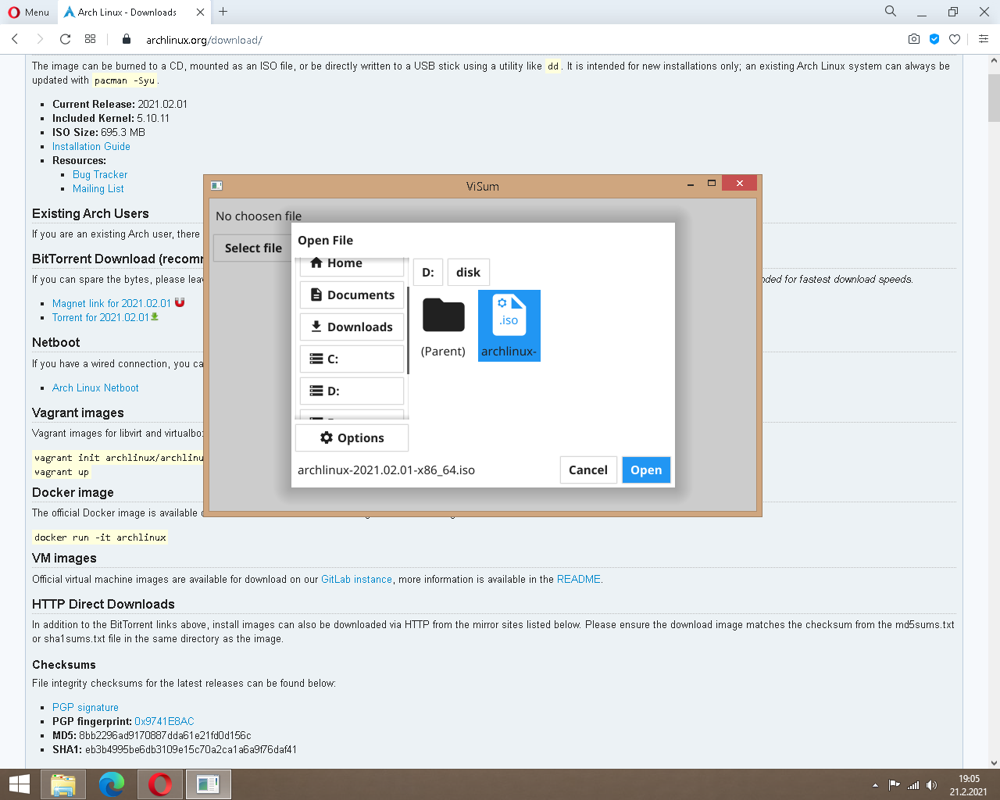
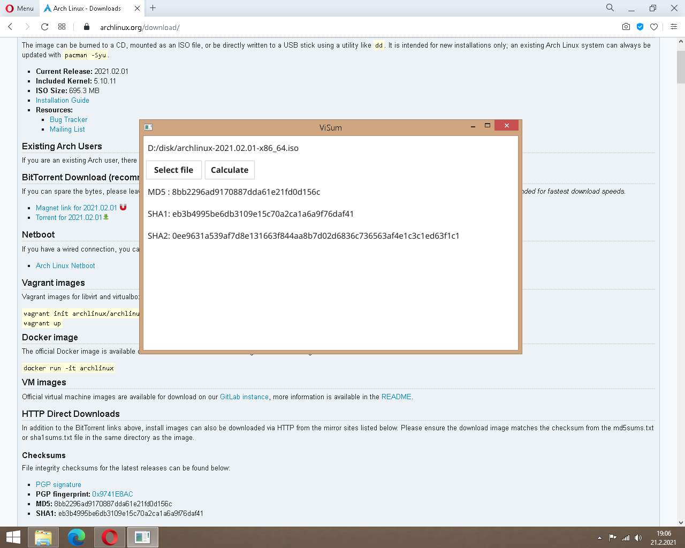

# ViSum

GUI for check integrity to downloaded files written with Golang.
 
### TR: 
İndirilen dosyaların bütünlüğünü kontrol etmek için Golang ile yazılmış grafik arabirim uygulaması.

 
 

 

Screenshot
----------

 

 

## License

 [MIT](https://github.com/ertane/ViSum/blob/main/LICENSE)

