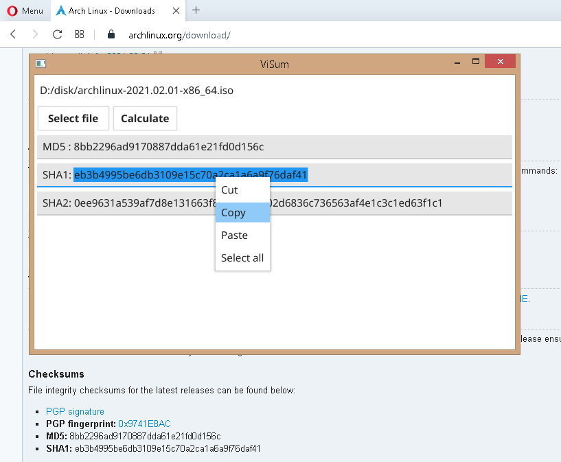

# ViSum

GUI for check integrity to downloaded files written with Golang.
 
### TR: 
İndirilen dosyaların bütünlüğünü kontrol etmek için Golang ile yazılmış grafik arabirim uygulaması.

 

 

### Build from source:

> open a command prompt or terminal
> 
> git clone https://github.com/ertane/ViSum.git
> 
> cd ViSum
> 
----------
> for windows
> 
> go build -o ViSum.exe main.go
> 
-----------
> for linux
> 
> go build -o ViSum main.go
> 

 

 

## Changes:

Added copy option for checksum. Closed issue [#1](https://github.com/ertane/ViSum/issues/1)

## Screenshot
-------------

 

 

## License
----------
Code is distributed under MIT license, feel free to use it in your proprietary
projects as well.

